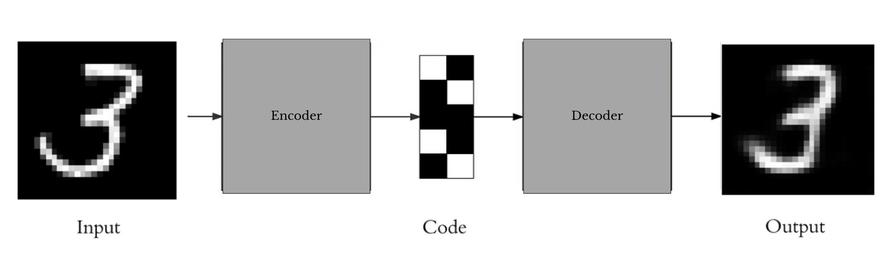
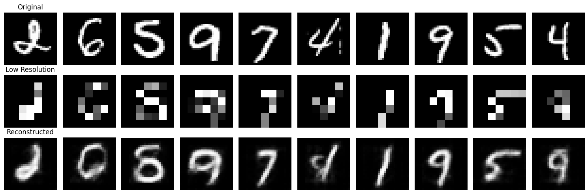
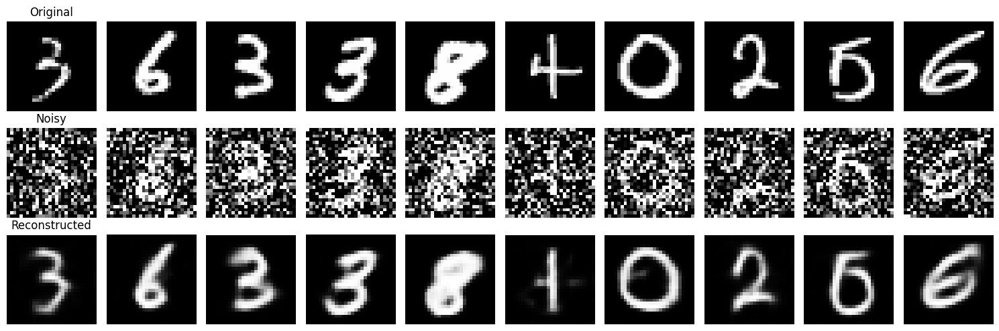
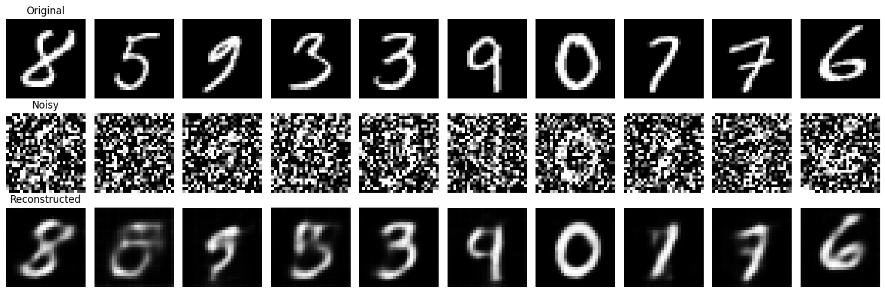
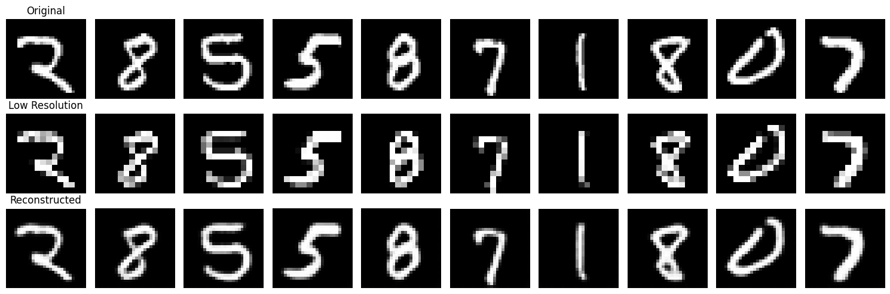

# **Autoencoders**
---


---

## **Descripción**

Este proyecto tiene como objetivo implementar y evaluar autoencoders, un tipo de red neuronal diseñada para tareas de compresión de datos, reducción de dimensionalidad y reconstrucción de datos. El proyecto se divide en dos aplicaciones prácticas: eliminación de ruido en imágenes y generación de imágenes de superresolución. Ambas tareas permiten explorar y comprender la capacidad de los autoencoders para aprender representaciones latentes significativas y reconstruir datos originales con alta fidelidad.

El trabajo incluye el diseño de modelos personalizados, su entrenamiento con el conjunto de datos MNIST, visualización de resultados y análisis de desempeño, cumpliendo con los objetivos establecidos y los entregables solicitados.

---

## **Estructura del Proyecto**

``` bash
Autoencoders/
└── data/
    └── MNIST/
        └── raw/
```
---

## **Análisis de Resultados**

## **Eliminación de ruido**

| **Tarea**               | **Tamaño de Entrada** | **Noise Factor** | **Learning Rate (lr)** | **Weight Decay** | **Pérdida Final (Training)** | **Pérdida Final (Validation)** | **Visualización de Resultados**          |
|--------------------------|-----------------------|------------------|------------------------|------------------|-----------------------------|--------------------------------|------------------------------------------|
| Eliminación de Ruido     | 28x28 (original)     | 0.5              | 0.001                 | 1e-05           | 0.0114                      | 0.00007                        |             |
| Eliminación de Ruido     | 28x28 (original)     | 0.7              | 0.001                 | 1e-05           | 0.0178                      | 0.00012                        |             |
| Eliminación de Ruido     | 28x28 (original)     | 0.9              | 0.001                 | 0.0001          | 0.0269                      | 0.00016                        |             |


## **Superresolución**

| **Tarea**               | **Tamaño de Entrada** | **Pérdida Inicial** | **Pérdida Final** | **Visualización de Resultados**        |
|--------------------------|-----------------------|----------------------|-------------------|----------------------------------------|
| Superresolución          | 7x7                  | 0.0443               | 0.0273            |   |
| Superresolución          | 14x14                | 0.0086               | 0.0047            |  |


---

## **Conclusiones**

Este proyecto demostró la eficacia y versatilidad de los autoencoders en dos tareas fundamentales: eliminación de ruido y superresolución. En la eliminación de ruido, el modelo logró reconstruir imágenes ruidosas con alta fidelidad, eliminando de manera efectiva el ruido gaussiano y preservando las características esenciales. Para la superresolución, se observó una clara dependencia del tamaño de las imágenes de entrada: las reconstrucciones generadas a partir de entradas de 7x7 capturaron las estructuras generales, pero carecieron de precisión en los detalles finos. Por otro lado, las entradas de 14x14 permitieron reconstrucciones mucho más detalladas y fieles a las imágenes originales, demostrando que un mayor tamaño inicial mejora significativamente el desempeño.

Los resultados obtenidos destacan la importancia de una adecuada configuración del modelo y la selección de los hiperparámetros, como el tamaño de entrada, la tasa de aprendizaje y la regularización. A través de visualizaciones detalladas, se evidenció la capacidad de los autoencoders para aprender representaciones latentes útiles y generar reconstrucciones de alta calidad. Este trabajo resalta el potencial de estas redes neuronales en tareas de procesamiento de imágenes, proporcionando un enfoque práctico para explorar aplicaciones reales como la mejora de calidad visual y la limpieza de datos.

---

## **Autores** ✒️

* **Hernández Guerra, Luna Yue** - [lunahernandez](https://github.com/lunahernandez)
* **Casimiro Torres, Kimberly** - [Kimberlycasimiro](https://github.com/Kimberlycasimiro)

#### **Universidad de Las Palmas de Gran Canaria (ULPGC)**